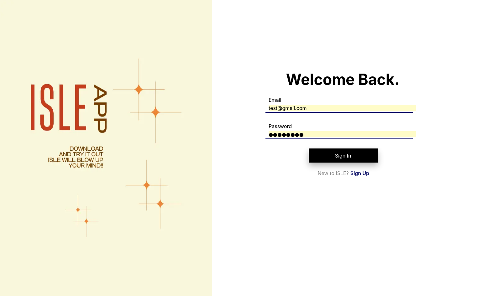
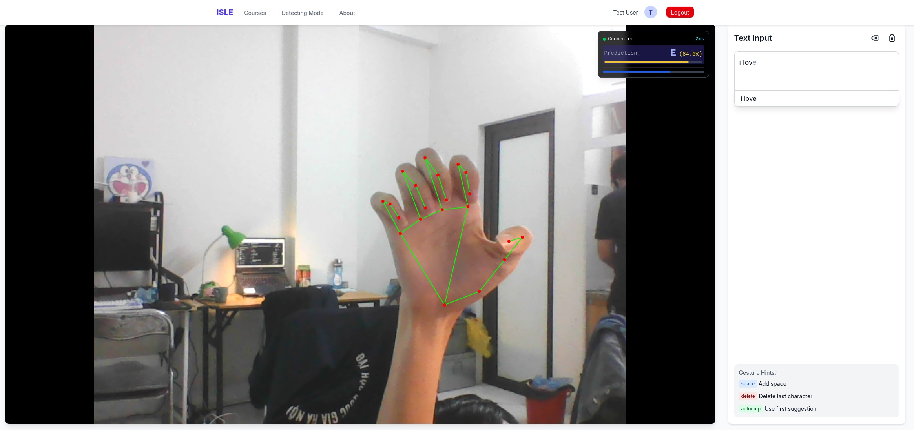
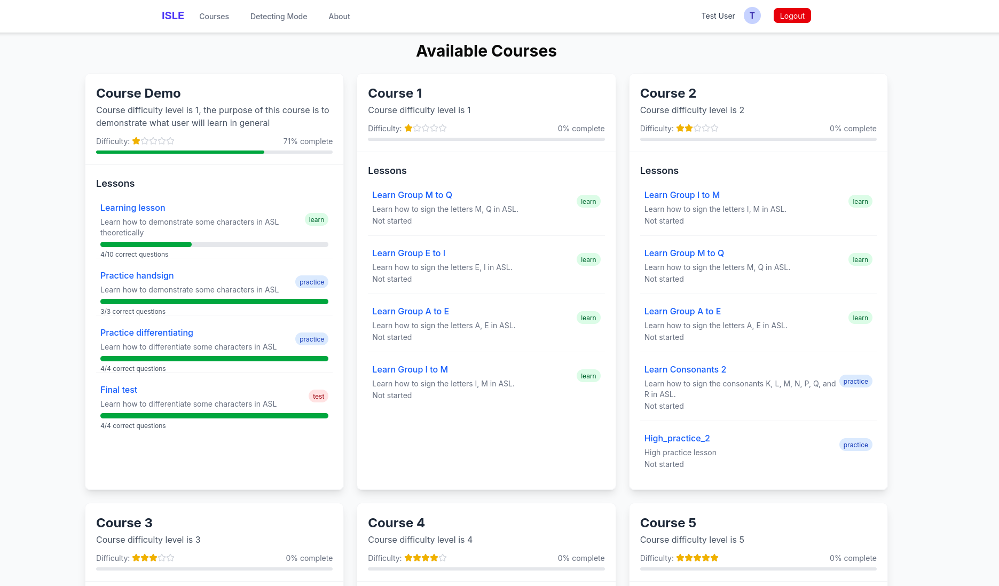
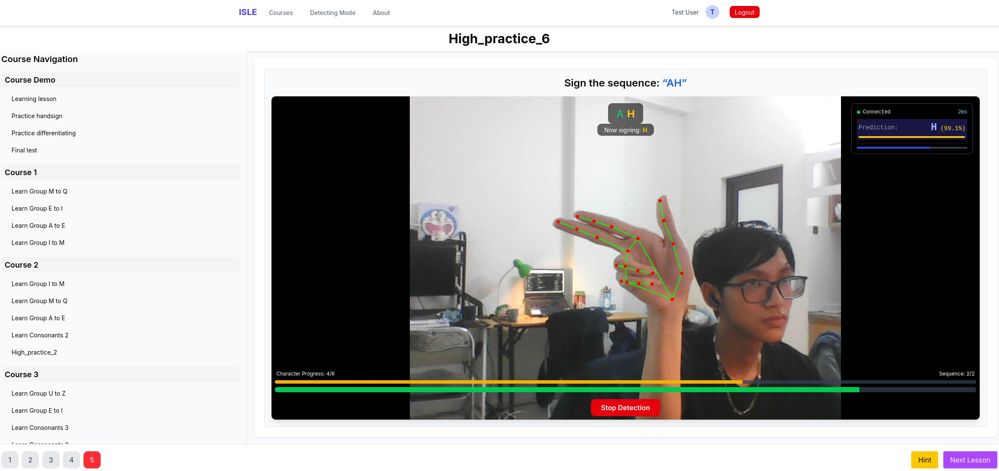

<h1 align="center">
  ISLE
</h1>

<h4 align="center">Hệ thống Nhận diện, hỗ trợ học tập Ký hiệu ngôn ngữ</h4>

<p align="center">
  <a href="">
    
  </a>
  <a href="https://hub.docker.com/r/legend0fhell/api">
    
  </a>
  <a href="https://hub.docker.com/r/legend0fhell/ml">
    
  </a>
  <a href="https://hub.docker.com/r/legend0fhell/site">
    
  </a>
  <a href="https://hub.docker.com/r/legend0fhell/db">
    
  </a>
  <a href="https://hub.docker.com/r/legend0fhell/nginx">
    
  </a>
</p>

<p align="center">
  <a href="#mô-tả-dự-án"> Mô tả dự án</a> •
  <a href="#tính-năng">Tính năng</a> •
  <a href="#hướng-dẫn-cài-đặt">Hướng dẫn cài đặt</a> •
  <a href="#link">Link</a> •
  <a href="#cấu-trúc-dự-án">Cấu trúc dự án</a> •
  <a href="#thành-viên-phát-triển">Thành viên phát triển</a>
</p>

---

<p align="center">
  
</p>


---

## Mô tả dự án

Để xem tài liệu chi tiết, vui lòng truy cập vào [Báo cáo chi tiết](https://drive.google.com/drive/folders/1B0yyAqPAsDNpzQCYAhXn3jDZxAe6x6kL?usp=sharing) của dự án trong Github hoặc có thể click vào đường link đã được gắn vào.

### Tóm tắt chung

ISLE (Interactive Sign Language Education) là một webapp đột phá, mang đến trải nghiệm mới lạ và độc đáo cho người dùng trong việc trải nghiệm nhận diện ngôn ngữ ASL (American Sign Language), giúp đỡ việc học tập ngôn ngữ này không còn nhàm chán, đồng thời giúp đỡ xóa bỏ rào cản ngôn ngữ và gắn kết những người bị khiếm khuyết với cộng đồng. Với mục tiêu cao cả như vậy, hệ thống của ISLE được xây dựng kỳ công với 3 thành phần chính:

- **Backend (FastAPI + PostgreSQL)**: Xử lý API, quản lý dữ liệu người dùng, dữ liệu ngôn ngữ, dữ liệu khóa học.
- **AI (Deep Learning)**: Nhận diện ngôn ngữ ký hiệu theo thời gian thực với độ chính xác vượt trội, mô hình gợi ý từ cho người dùng thông minh.
- **Frontend (NextJS + TailwindCSS)**: Giao diện web thân thiện và dễ làm quen cho người dùng.
- **Nginx**: : Hệ thống reverse proxy, cân bằng tải. Chịu trách nhiệm định tuyến yêu cầu từ người dùng đến các phần của hệ thống. Đồng thời, cũng đóng vai trò làm lớp bảo vệ đầu tiên trước các truy cập trái phép và giúp tối ưu hiệu suất tổng thể của hệ thống.

Các thành phần giao tiếp với nhau qua giao thức RESTful API và WebSocket, hỗ trợ triển khai nhanh chóng, hiệu quả bằng Docker.

---

## Tính năng

- Nhận diện ngôn ngữ ASL thời gian thực bằng mô hình trí tuệ nhân tạo.
- Quản lý phiên đăng nhập, dữ liệu người dùng, dữ liệu lớp học và câu hỏi.
- Giao diện web trực quan cho người dùng.
- Tích hợp WebSocket cho truyền dữ liệu camera và kết quả nhận diện.
- Dễ dàng triển khai với Docker Compose.
- Triển khai khóa học và hướng dẫn sử dụng ngôn ngữ ASL cho người dùng.

---

## Hướng dẫn cài đặt

### 1. Yêu cầu

- [Docker](https://www.docker.com/products/docker-desktop) và [Docker Compose](https://docs.docker.com/compose/).

### 2. Tải `docker-compose.yml`

File đã được nộp trên hệ thống UET-LMS, hoặc có thể tải file `docker-compose.yml` tại GitHub repo này.
  
### 3. Chạy hệ thống

```bash
docker-compose up -d
```
Hướng dẫn sử dụng website (vui lòng đọc kĩ trước khi sử dụng): [`Tài liệu hướng dẫn sử dụng`](https://drive.google.com/drive/folders/12BjFiZTVHgaokd36Genj_v1ltk5Jyqiw?usp=drive_link) 

Tài khoản người dùng mẫu:
- **Email**: `test@gmail.com`
- **Pass**: `testtest`

Khóa học mẫu `Course Demo` cho phép trải nghiệm toàn bộ tính năng của hệ thống.

Để truy cập các phần của website:
- **Trang chính**: http://localhost (hoặc http://127.0.0.1:80)
- **Đăng nhập**: http://localhost/login
- **Đăng ký**: http://localhost/signup
- **Khóa học**: http://localhost/courses
- **Trang nhận diện tay**: http://localhost/detecting-mode
- **Docs API Backend**: http://localhost:8000/docs/
---

## Thành viên phát triển
- Phan Quang Trường
- Bùi Minh Quân
- Phạm Nhật Quang

## Link
### a. DockerHub
- API: [`legend0fhell/api`](https://hub.docker.com/r/legend0fhell/api)
- ML: [`legend0fhell/ml`](https://hub.docker.com/r/legend0fhell/ml)
- UI/UX: [`legend0fhell/site`](https://hub.docker.com/r/legend0fhell/site)
- Databse:[`legend0fhell/db`](https://hub.docker.com/r/legend0fhell/db)
- NGINX:[`legend0fhell/nginx`](https://hub.docker.com/r/legend0fhell/nginx)

### b. GitHub
- GitHub dự án: [`GitHub dự án`](https://github.com/Legend0fHell/isle-backend)
---

## Demo
### Chức năng Đăng nhập/đăng xuất


### Chức năng Nhận diện/Đề xuất


### Chức năng Khóa học


### Chức năng Bài học


### Ký hiệu ngôn ngữ


## Cấu trúc dự án

```
ISLE/
├── api/
├── ml/
├── nginx/
├── site/
├── docker-compose.yml
└── README.md
```
---


---
> © 2025 ISLE Team
